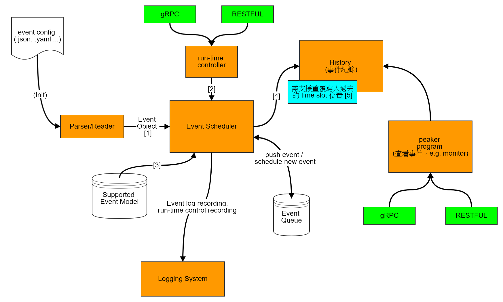

# LifeGamer Event 設計

* [1] : 其 event 種類、 event model (e.g. `poisson`,`expon` ... etc)，以及相關的參數控制 
* [2] : 於遊戲進行時，其他玩家主動發動的事件 (不是一開始透過 *event config* 來做設定的事件)
* [3] : template 的概念，設定目前 event scheduler 能夠支援的模型
* [4] : 利用 timeline 及 event 發生 log ( 紀錄從 game start 到現在之間每個 event 的 timestamp )
* [5] : 因為原 *event config* 所 schedule 進去的事件序列會持續進行 (e.g. 其 schedule + 寫入的速度會遠大於目前遊戲進行的速度，這表示遊戲玩家進行遊戲時，透過 `run-time controller` 發佈自己的事件進入 event queue 後，產生對應事件 history 的 timestamp 必定是在 "已發生" 的 time slot 內)。 
    * 所以需要配合 run-time controller 即時加新 event 